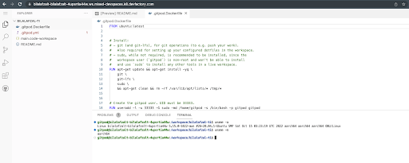

# User Manual

## Initial Setup
1. Go to [Mixed Devspaces](https://mixed-devspaces.k8.devfactory.com/) which has a devspaces instance capable of hosting both ARM and x86 workspaces
2. Authenticate with your Github
3. Click on Open workspace and enter URL of a github repository that you want to open in the workspace

** IMPORTANT **
- If you want specify a custom image or dockerfile, ensure the the image or the dockerfile base has a relevant tag for the architecture you are targeting. Otherwise the Workspace will be stuck on the loading screen.
- In future releases, we will ensure that the workspace errors out with a clear message 
- We recommend using the following [repo](https://github.com/bilalafzal-ti/bilalafzal-ti) for testing out basic functionalities

## Switching between Arch
To specify which architecture on which you want to run the workspace, edit the .gitpod.yml to include the `arch` field

```yaml
arch: x86
```
OR
```yaml
arch: arm
```

You can confirm the architecture after the workspace has opened by opening a terminal and running
```bash
uname -m
```


### **IMPORTANT**

You can also specify a custom image to be used to run the workspace or as the base for a dockerfile. However, the users must ensure this base image exists for the architecture they are trying to run the workspace in. If the base image does not exist for the specified architecture, the workspace will fail silently and be stuck in initializing mode

## Snapshots
You can create and share snapshots of the workspace by clicking on the hamburger menu on top left and selecting share workspace snapshot


Snapshots save the exact state of the current workspace, even uncommited files and installed libraries/utilities.

## Teams, Projects and Prebuilds
1. To enable prebuilds for a repository go to the [dashboard](https://mixed-devspaces.k8.devfactory.com/workspaces)
2. Create a new team

3. Add a project and add your repository to the project.
4. Prebuilds will now be enabled for this repository. Prebuilds save alot of time by running workspace tasks in advance, shaving off the time required to run builds or other initialization tasks

